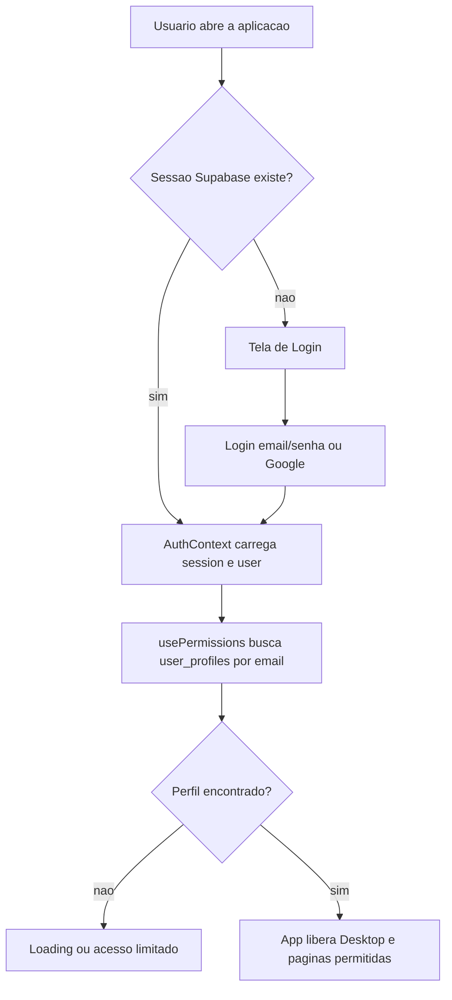
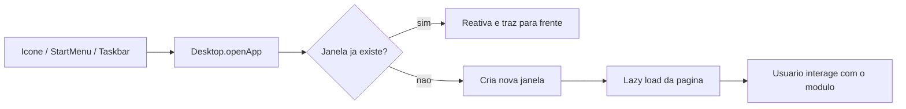
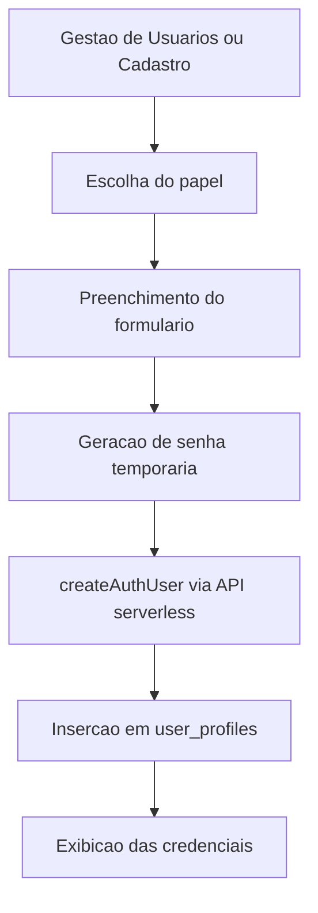
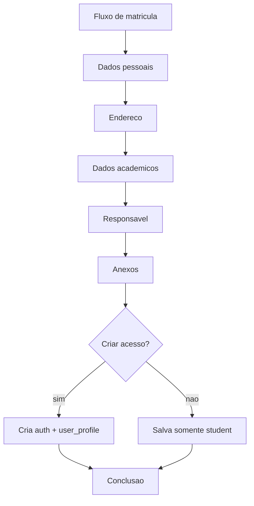
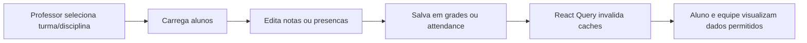
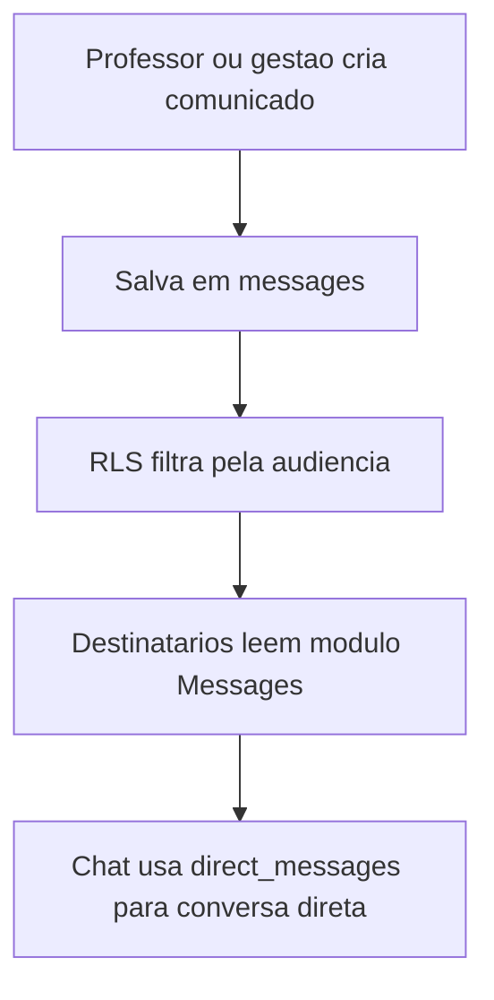

<!-- ðæÐïð╗ ËÖð╣ð▒ðÁÐÇÊÖðÁ ÐéÐâð╗ÐïÊ╗Ðïð¢Ðüð░ Whyktor GSV ð║ð¥ð╝ð┐ð░ð¢ð©ÐÅÊ╗Ðï ðÁÐéðÁÐêÐéðÁÐÇËÖ. -->
# Fluxos Principais

## 1. Autenticacao e resolucao de perfil

Arquivos envolvidos:

- [src/lib/AuthContext.jsx](/C:/Users/Home/Pictures/TCC_Claude/projeto/escola-supabase/TCC-2/src/lib/AuthContext.jsx)
- [src/components/hooks/usePermissions.jsx](/C:/Users/Home/Pictures/TCC_Claude/projeto/escola-supabase/TCC-2/src/components/hooks/usePermissions.jsx)
- [src/App.jsx](/C:/Users/Home/Pictures/TCC_Claude/projeto/escola-supabase/TCC-2/src/App.jsx)

## 2. Abertura de modulo no desktop

Arquivos envolvidos:

- [src/pages/Desktop.jsx](/C:/Users/Home/Pictures/TCC_Claude/projeto/escola-supabase/TCC-2/src/pages/Desktop.jsx)
- [src/components/desktop/Window.jsx](/C:/Users/Home/Pictures/TCC_Claude/projeto/escola-supabase/TCC-2/src/components/desktop/Window.jsx)
- [src/lib/appRegistry.js](/C:/Users/Home/Pictures/TCC_Claude/projeto/escola-supabase/TCC-2/src/lib/appRegistry.js)

## 3. Cadastro de usuario

Arquivos envolvidos:

- [src/pages/UserManagement.jsx](/C:/Users/Home/Pictures/TCC_Claude/projeto/escola-supabase/TCC-2/src/pages/UserManagement.jsx)
- [src/pages/Registration.jsx](/C:/Users/Home/Pictures/TCC_Claude/projeto/escola-supabase/TCC-2/src/pages/Registration.jsx)
- [src/lib/supabaseAdmin.js](/C:/Users/Home/Pictures/TCC_Claude/projeto/escola-supabase/TCC-2/src/lib/supabaseAdmin.js)
- [api/admin/users.js](/C:/Users/Home/Pictures/TCC_Claude/projeto/escola-supabase/TCC-2/api/admin/users.js)

## 4. Matricula de aluno

Arquivos envolvidos:

- [src/pages/Registration.jsx](/C:/Users/Home/Pictures/TCC_Claude/projeto/escola-supabase/TCC-2/src/pages/Registration.jsx)
- [src/pages/StudentEnrollment.jsx](/C:/Users/Home/Pictures/TCC_Claude/projeto/escola-supabase/TCC-2/src/pages/StudentEnrollment.jsx)
- [src/components/enrollment/SectionAttachments.jsx](/C:/Users/Home/Pictures/TCC_Claude/projeto/escola-supabase/TCC-2/src/components/enrollment/SectionAttachments.jsx)

## 5. Lancamento de notas e frequencia

Arquivos envolvidos:

- [src/pages/Grades.jsx](/C:/Users/Home/Pictures/TCC_Claude/projeto/escola-supabase/TCC-2/src/pages/Grades.jsx)
- [src/pages/Attendance.jsx](/C:/Users/Home/Pictures/TCC_Claude/projeto/escola-supabase/TCC-2/src/pages/Attendance.jsx)
- [src/pages/AcademicRecord.jsx](/C:/Users/Home/Pictures/TCC_Claude/projeto/escola-supabase/TCC-2/src/pages/AcademicRecord.jsx)

## 6. Comunicacao

Arquivos envolvidos:

- [src/pages/Messages.jsx](/C:/Users/Home/Pictures/TCC_Claude/projeto/escola-supabase/TCC-2/src/pages/Messages.jsx)
- [src/components/chat/ChatHub.jsx](/C:/Users/Home/Pictures/TCC_Claude/projeto/escola-supabase/TCC-2/src/components/chat/ChatHub.jsx)
- [supabase/migration_permissions_hardening.sql](/C:/Users/Home/Pictures/TCC_Claude/projeto/escola-supabase/TCC-2/supabase/migration_permissions_hardening.sql)
