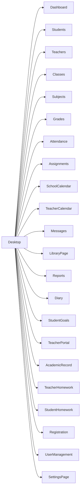

# Mapa de Rotas e Navegacao

## Rotas principais

| Rota | Pagina | Observacao |
|---|---|---|
| `/` | pagina principal configurada | hoje aponta para `Desktop` |
| `/Desktop` | shell principal | area de trabalho com janelas |
| `/Dashboard` | dashboard | indicadores e atalhos |
| `/Students` | alunos | CRUD |
| `/Teachers` | professores | CRUD |
| `/Classes` | turmas | CRUD |
| `/Subjects` | disciplinas | CRUD |
| `/Grades` | notas | lancamento e consulta |
| `/Attendance` | frequencia | chamada e acompanhamento |
| `/Assignments` | atividades | publicacao e entregas |
| `/SchoolCalendar` | calendario escolar | eventos institucionais |
| `/TeacherCalendar` | agenda do professor | agenda operacional |
| `/Messages` | comunicados | mensagens por audiencia |
| `/LibraryPage` | biblioteca | acervo e emprestimos |
| `/Reports` | relatorios | analiticos |
| `/Diary` | diario | diario e planos |
| `/StudentGoals` | metas | uso do aluno |
| `/TeacherPortal` | portal do professor | visao consolidada |
| `/AcademicRecord` | registro academico | notas e frequencia agregadas |
| `/TeacherHomework` | tarefas do professor | tarefas de casa |
| `/StudentHomework` | tarefas do aluno | acompanhamento individual |
| `/Registration` | cadastro | matricula e criacao de usuarios |
| `/StudentEnrollment` | matricula segmentada | fluxo especifico |
| `/UserManagement` | usuarios | aprovacoes, perfis, senha |
| `/SettingsPage` | configuracoes | opcoes gerais |

## Diagrama de navegacao

## Regras de acesso por rota

As regras de roteamento sao mantidas em [src/App.jsx](/C:/Users/Home/Pictures/TCC_Claude/projeto/escola-supabase/TCC-2/src/App.jsx) por meio de `PAGE_ACCESS_RULES`.

Comportamento:

- usuario sem sessao vai para `Login`;
- usuario autenticado sem permissao e redirecionado para `/Desktop`;
- paginas sao carregadas sob demanda com `React.lazy`.

## Navegacao interna relevante

- `Dashboard` aciona atalhos rapidos para `Registration`, `Grades`, `Attendance`, `Assignments`, `Messages`, `LibraryPage` e `SchoolCalendar`.
- `Desktop` permite abrir paginas por icones, menu iniciar e taskbar.
- `UserManagement` consegue abrir o fluxo de `Registration` com `initialModeProp: 'usuario'`.

## Persistencia de navegacao

O frontend guarda contexto de navegacao em `sessionStorage`:

- `route_current`
- `route_previous`

Essa logica esta em [src/App.jsx](/C:/Users/Home/Pictures/TCC_Claude/projeto/escola-supabase/TCC-2/src/App.jsx), no componente `RouteHistoryTracker`.
